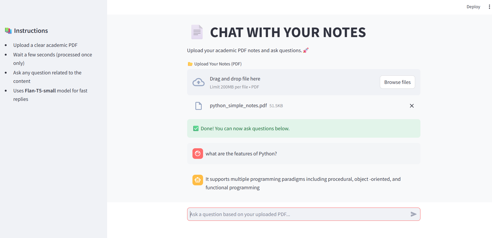

# 📄 Chat with Your Notes (HuggingFace + Streamlit)

An LLM-powered chatbot that allows users to upload academic PDF notes and ask questions based on the content. The bot uses HuggingFace's free FLAN-T5 model and LangChain for document retrieval and response generation.

## 🚀 Features

- Upload any academic PDF (Python, DSA, etc.)
- Ask questions from your own notes
- Uses LangChain + HuggingFace pipelines
- Fast, free — no OpenAI key needed
- Clean Streamlit UI with chat-style interface

## 🛠️ Tech Stack

- Python
- Streamlit
- LangChain
- HuggingFace Transformers
- FAISS (Vector Store)
- PyPDF2

## 📦 Installation

git clone https://github.com/ARYA-AS/chat_with_notes_bot.git
cd chat_with_notes_bot
pip install -r requirements.txt

▶️ Run the App

streamlit run app.py

Then open: http://localhost:8501

